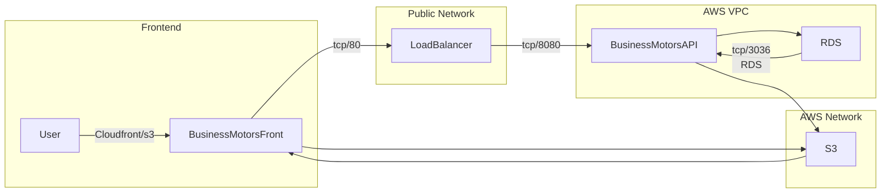
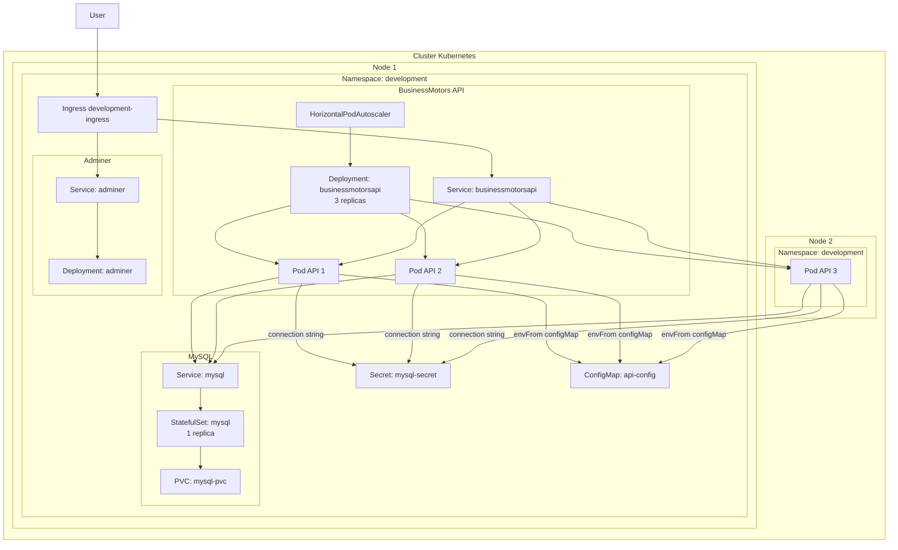
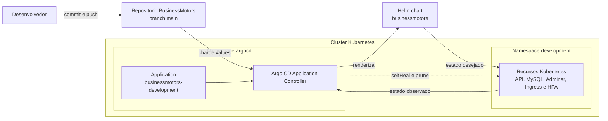

<h1> 
  BusinessMotors
</h1>

## 📌 Overview
It's a project with many technologies.
Has a WebAPI to sale motors using the best principles of software development.

## 💻 Technologies
These are all the technologies and patterns used to develop this application
- Framework: .NET 8
- Cloud Provider: AWS - Services(ECR, ECS, VPC, ALB, TG, RDS, DynamoDB, S3)
- IaC: Terraform
- Container: Docker, Docker Compose
- Orchestration: Kubernetes
- Packaging and deployment: Helm
- GitOps continuous delivery: Argo CD
- Observability: Grafana, Sentry
- Metrics: Prometheus
- Cache: Redis
- ORM: Entity Framework
- CI/CD: GitHub Actions
- Observability: Prometheus, Grafana, ElasticSearch, Kibana, Sentry

## High level diagram



## Visão do cluster Kubernetes

A estrutura abaixo representa a arquitetura aplicada no namespace `development` com base nos manifestos em `kubernetes/manifests`, considerando um cluster com dois nós workers.



## Deploy Kubernetes com Helm e Argo CD

O repositório mantém duas formas de declarar os recursos Kubernetes:

- **Manifests diretos:** arquivos em `src/BusinessMotors/kubernetes/manifests/`, aplicados com `kubectl`.
- **Helm:** chart em `src/BusinessMotors/kubernetes/helm/businessmotors/`. O `values.yaml` contém a configuração base e `values-development.yaml` define os valores usados no Kind.
- **Argo CD:** a `Application` em `src/BusinessMotors/kubernetes/argocd/applications/businessmotors-development.yaml` acompanha a branch `main`, renderiza o chart Helm e sincroniza os recursos no namespace `development`.

### Fluxo GitOps



O Argo CD compara o estado declarado no Git com o estado do cluster. A sincronização automática aplica mudanças; `selfHeal` corrige alterações feitas fora do Git e `prune` remove recursos que foram retirados da configuração. A opção `CreateNamespace=true` cria o namespace `development` quando necessário.

### Instalação manual com Helm

Execute a partir da raiz do repositório:

```bash
helm lint src/BusinessMotors/kubernetes/helm/businessmotors \
  -f src/BusinessMotors/kubernetes/helm/businessmotors/values-development.yaml

helm upgrade --install businessmotors \
  src/BusinessMotors/kubernetes/helm/businessmotors \
  --namespace development --create-namespace \
  --values src/BusinessMotors/kubernetes/helm/businessmotors/values-development.yaml
```

### Ativação pelo Argo CD

Com o Argo CD instalado no cluster e acesso ao repositório configurado, registre a aplicação:

```bash
kubectl apply -f src/BusinessMotors/kubernetes/argocd/applications/businessmotors-development.yaml
argocd app get businessmotors-development
```

Revise `repoURL`, `targetRevision` e `path` no manifesto da `Application` ao usar outro repositório, branch ou localização do chart.

> Use apenas um método de instalação por namespace. Os manifests diretos e o chart gerenciam recursos com nomes equivalentes; aplicá-los ao mesmo tempo pode causar disputa de ownership e divergência de estado. Os valores de senha incluídos são exemplos locais: em ambientes compartilhados ou de produção, forneça um Secret externo e não armazene credenciais no Git.

O chart configura os recursos `Ingress` e HPA, mas não instala o NGINX Ingress Controller nem o Metrics Server. Esses componentes precisam estar disponíveis no cluster para que o acesso pelo Ingress e o autoscaling funcionem.