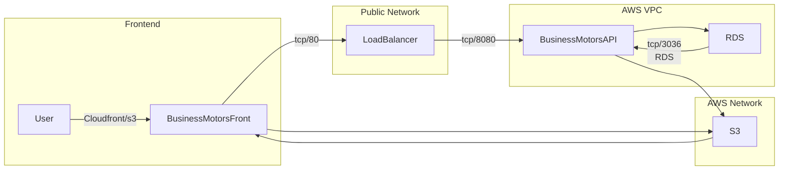
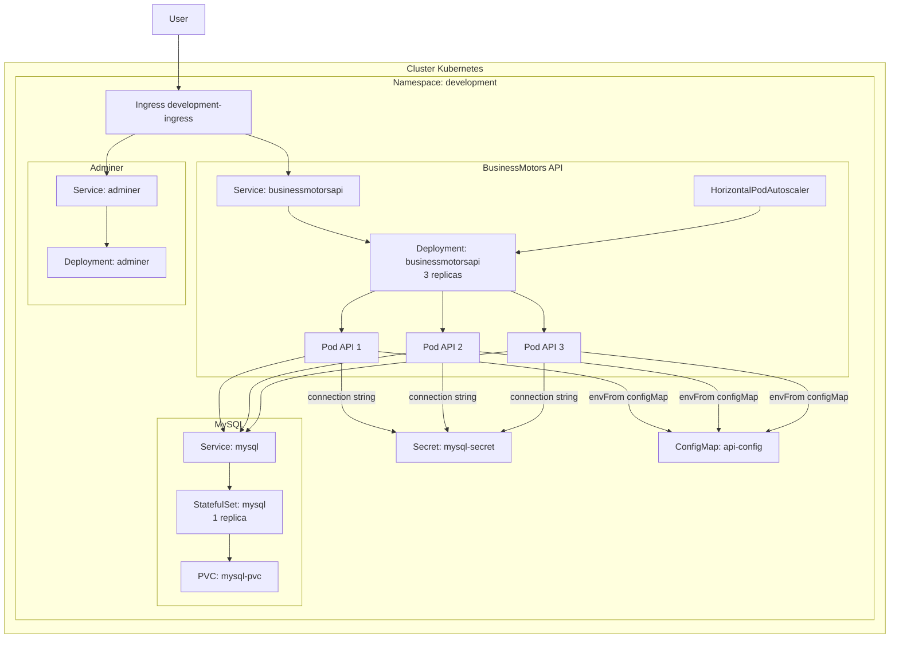

<h1> 
  BusinessMotors
</h1>

## 📌 Overview
It's a project with many technologies.
Has a WebAPI to sale motors using the best principles of software development.

## 💻 Technologies
These are all the technologies and patterns used to develop this application
- Framework: .NET 8
- Cloud Provider: AWS - Services(ECR, ECS, VPC, ALB, TG, RDS, DynamoDB, S3)
- IaC: Terraform
- Container: Docker, Docker Compose
- Orchestration: Kubernetes
- Observability: Grafana, Sentry
- Metrics: Prometheus
- Cache: Redis
- ORM: Entity Framework
- CI/CD: GitHub Actions
- Observability: Prometheus, Grafana, ElasticSearch, Kibana, Sentry

## High level diagram

## Visão do cluster Kubernetes

A estrutura abaixo representa a arquitetura aplicada no namespace `development` com base nos manifestos em `kubernetes/manifests`.

