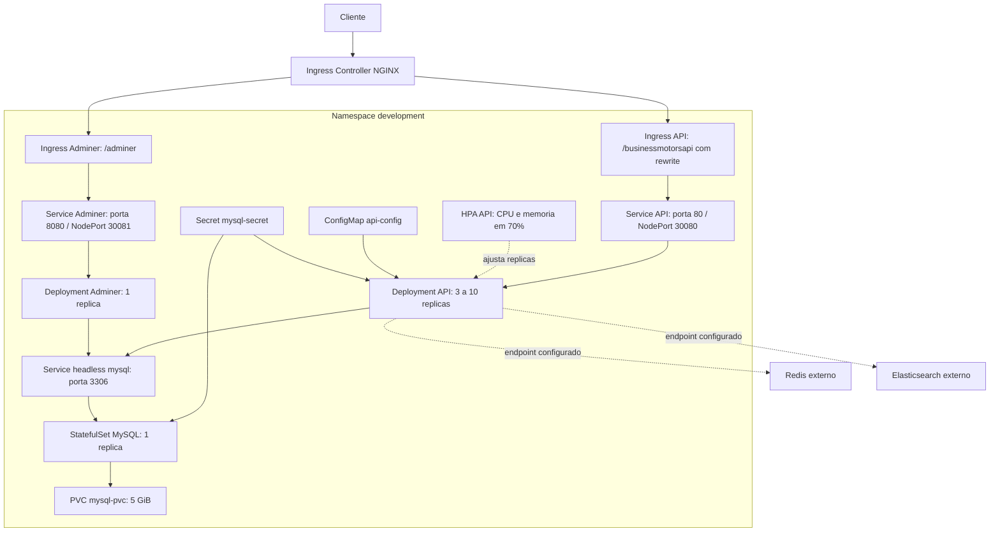
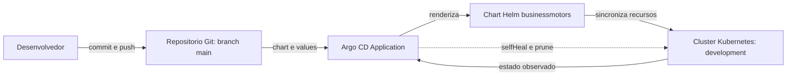

# Kubernetes - BusinessMotors

Este diretorio contem os recursos para executar a API BusinessMotors no Kubernetes. Ha duas formas de instalar a aplicacao: aplicar os manifests diretamente ou instalar o chart Helm, manualmente ou por meio do Argo CD.

```text
kubernetes/
|-- manifests/                         # Recursos Kubernetes aplicados diretamente
|-- helm/
|   `-- businessmotors/                # Chart Helm da aplicacao
|       |-- templates/                 # Templates dos recursos Kubernetes
|       |-- values.yaml                # Valores base do chart
|       `-- values-development.yaml    # Overrides locais para Kind
|-- argocd/
|   `-- applications/                  # Applications que apontam para charts Helm
|-- kind-config.yaml                   # Cluster Kind e portas locais
|-- helpers.md                         # Guia passo a passo para o ambiente Kind
`-- README.md                          # Esta visao geral
```

## Visao dos componentes

O diagrama representa os recursos entregues pelo chart e suas relacoes. O controller NGINX, o Metrics Server, Redis e Elasticsearch sao dependencias externas: este chart configura Ingress, HPA e endpoints da API, mas nao instala esses servicos.



### Responsabilidades

- **API:** Deployment com probes HTTP em `/health`, configuracao em ConfigMap e conexao com MySQL por Secret. O HPA ajusta as replicas entre 3 e 10 conforme CPU e memoria.
- **MySQL:** StatefulSet de uma replica, Service headless para DNS interno e PVC de 5 GiB para persistencia.
- **Adminer:** Deployment e Service para administrar o banco; usa o Service `mysql` como servidor padrao.
- **Ingress:** encaminha `/businessmotorsapi` a API e remove esse prefixo com rewrite. `/adminer` usa uma regra propria, sem a anotacao de rewrite da API.
- **NodePorts:** API em `localhost:30080` e Adminer em `localhost:30081`, como alternativa ao Ingress no Kind.

## Organizacao

- `manifests/` contem os recursos Kubernetes para aplicacao direta com `kubectl`.
- `helm/businessmotors/Chart.yaml` identifica o chart; `templates/` gera os recursos Kubernetes.
- `helm/businessmotors/values.yaml` define a configuracao base e `values-development.yaml` seleciona as imagens de desenvolvimento para Kind.
- `argocd/applications/` contem recursos `Application` do Argo CD que apontam para charts no repositorio.
- `kind-config.yaml` define o cluster Kind e mapeia as portas 80, 443, 30080 e 30081.
- `helpers.md` apresenta o passo a passo de criacao do cluster, carregamento de imagens e instalacao de dependencias.

## Escolha um metodo de instalacao

Os manifests diretos e os templates Helm criam recursos com nomes equivalentes. Escolha **um unico metodo por namespace** para evitar que Helm, Argo CD e `kubectl apply` disputem os mesmos objetos.

### Manifests diretos

Crie o namespace antes de aplicar os arquivos:

```bash
kubectl create namespace development
kubectl apply -f manifests/
kubectl get all -n development
```

### Helm

Execute a partir deste diretorio:

```bash
helm lint helm/businessmotors -f helm/businessmotors/values-development.yaml
helm template businessmotors helm/businessmotors \
  --namespace development \
  --values helm/businessmotors/values-development.yaml
helm upgrade --install businessmotors helm/businessmotors \
  --namespace development --create-namespace \
  --values helm/businessmotors/values-development.yaml
```

O chart cria os recursos da aplicacao, mas nao instala o controller NGINX nem o Metrics Server. O primeiro e necessario para atender as rotas Ingress; o segundo fornece metricas para o HPA.

### Argo CD

O arquivo [businessmotors-development.yaml](argocd/applications/businessmotors-development.yaml) declara uma `Application` no namespace `argocd`. Ela acompanha a branch `main` do repositorio `BusinessMotors`, usa o chart em `src/BusinessMotors/kubernetes/helm/businessmotors` e sincroniza no namespace `development`.

Instale e configure o Argo CD no cluster. Depois, a partir deste diretorio, registre a aplicacao:

```bash
kubectl apply -f argocd/applications/businessmotors-development.yaml
argocd app get businessmotors-development
```



O manifesto habilita sincronizacao automatica, `selfHeal` para corrigir divergencias e `prune` para remover recursos retirados do chart. Antes da sincronizacao, confira `repoURL`, `targetRevision` e `path` no `Application`. A opcao `CreateNamespace=true` cria o namespace de destino quando necessario.

## Configuracao e segredos

Os values atuais usam imagens com tag `latest` e credenciais de exemplo (`secret`), adequadas apenas para desenvolvimento local. No Kind, carregue as imagens no cluster antes da instalacao e ajuste as tags em `values-development.yaml` se necessario.

Em ambientes compartilhados ou de producao, nao armazene senhas no Git. Crie previamente `mysql-secret` no namespace de destino com as chaves `root-password`, `database`, `user`, `password` e `connection-string`; configure `mysql.auth.createSecret: false` e `mysql.auth.existingSecret: mysql-secret` nos values usados pelo Helm ou Argo CD.

Redis e Elasticsearch aparecem apenas como endpoints de configuracao da API neste chart. Os servicos precisam ser provisionados separadamente se a aplicacao depender deles.